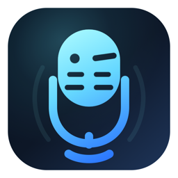

<div align="center">
  
  <h1>VoiceWink</h1>
  <p>Security-conscious, local-first voice dictation for macOS</p>

  [](https://www.gnu.org/licenses/gpl-3.0)
  
</div>

---

VoiceWink is a fork of [Beingpax/VoiceInk](https://github.com/Beingpax/VoiceInk) for environments that need a narrower, more security-conscious baseline.

This fork keeps the core dictation workflow intact:
- local transcription with a bundled starter model
- explicit microphone selection
- configurable recording shortcuts
- history and last-transcription access
- top-level discoverability of retained controls

At the same time, it removes product areas that do not fit the local-only fork direction:
- cloud transcription providers
- AI enhancement providers and prompt flows
- licensing and pro-upgrade paths
- announcements, promotions, and marketing surfaces

## Why This Fork Exists

VoiceInk is the original project and the work this fork builds on. VoiceWink exists for teams and users who need a tighter deployment posture, fewer moving parts, and a local-only default.

If VoiceInk works for your setup, support the original app at [tryvoiceink.com](https://tryvoiceink.com). Even if you use VoiceWink, supporting VoiceInk helps fund the upstream work that made this fork possible.

## Getting Started

### Build from Source

VoiceWink is currently set up first for source builds:

```bash
git clone <your-voicewink-repo-url> VoiceWink
cd VoiceWink
make local
open ./VoiceWink.app
```

For full build details, see [BUILDING.md](BUILDING.md).

### Releases

- Local testing builds use `make local`.
- Distribution builds use `make release-archive` with a real Developer ID identity.
- A Homebrew cask for this fork is not published yet.

## Documentation

- [Building from Source](BUILDING.md)
- [Contributing Guidelines](CONTRIBUTING.md)
- [Code of Conduct](CODE_OF_CONDUCT.md)

## Contributing

Treat this repository as a maintained fork, not as the upstream VoiceInk project.

If you are maintaining this fork:
- keep release-facing identity as VoiceWink
- keep the local-only security posture intact
- avoid reintroducing removed cloud, enhancement, or commercial surfaces without an explicit product decision

## License

This project remains licensed under the GNU General Public License v3.0. See [LICENSE](LICENSE).

## Acknowledgments

### Upstream

- [Beingpax/VoiceInk](https://github.com/Beingpax/VoiceInk)

### Core Technology

- [whisper.cpp](https://github.com/ggerganov/whisper.cpp)
- [FluidAudio](https://github.com/FluidInference/FluidAudio)

### Essential Dependencies

- [Sparkle](https://github.com/sparkle-project/Sparkle), for keeping VoiceWink up to date
- [KeyboardShortcuts](https://github.com/sindresorhus/KeyboardShortcuts)
- [LaunchAtLogin](https://github.com/sindresorhus/LaunchAtLogin)
- [MediaRemoteAdapter](https://github.com/ejbills/mediaremote-adapter)
- [Zip](https://github.com/marmelroy/Zip)
- [SelectedTextKit](https://github.com/tisfeng/SelectedTextKit)
- [Swift Atomics](https://github.com/apple/swift-atomics)
